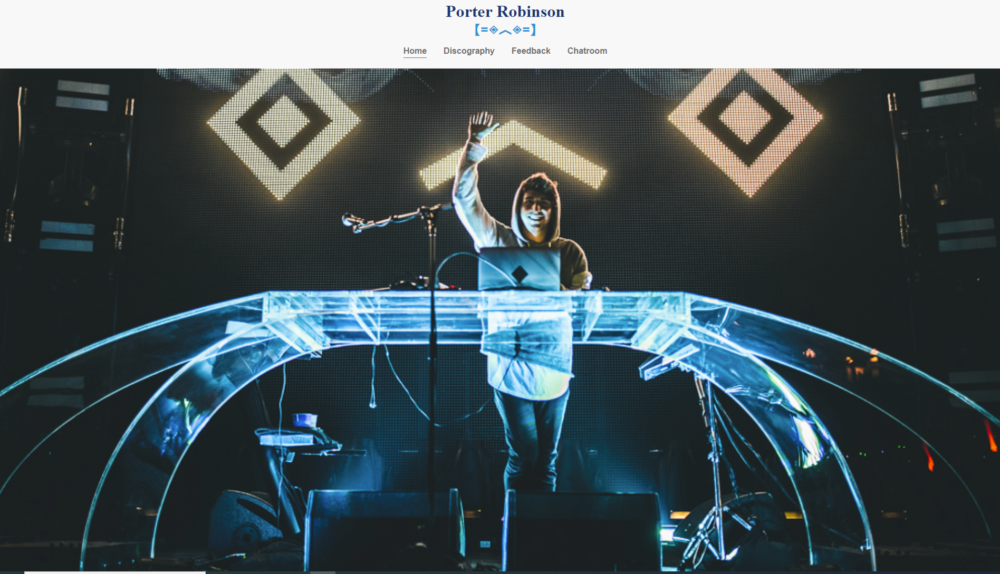
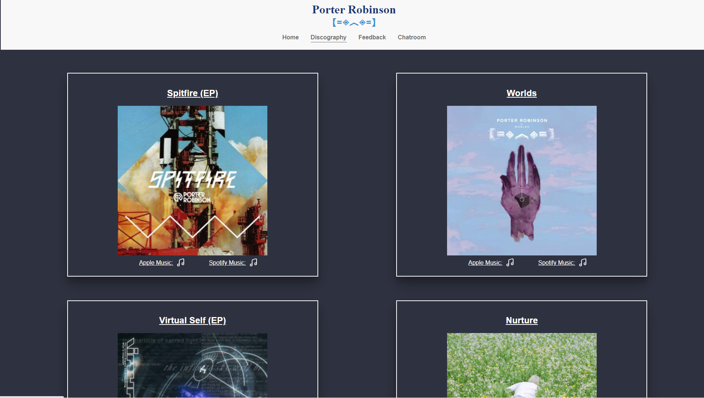
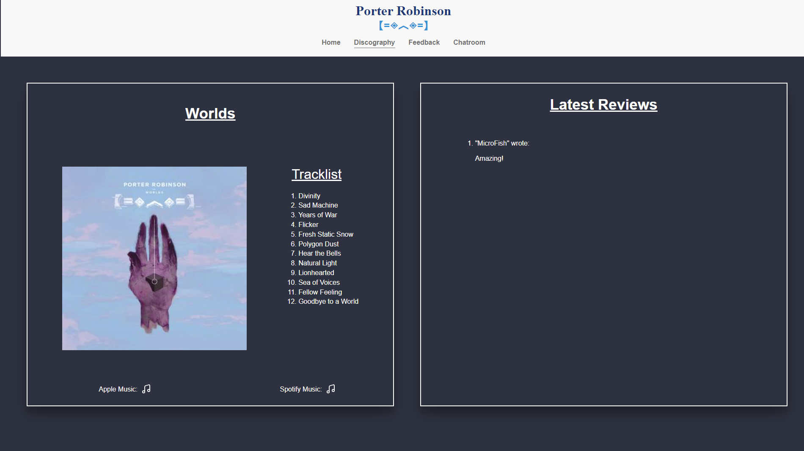
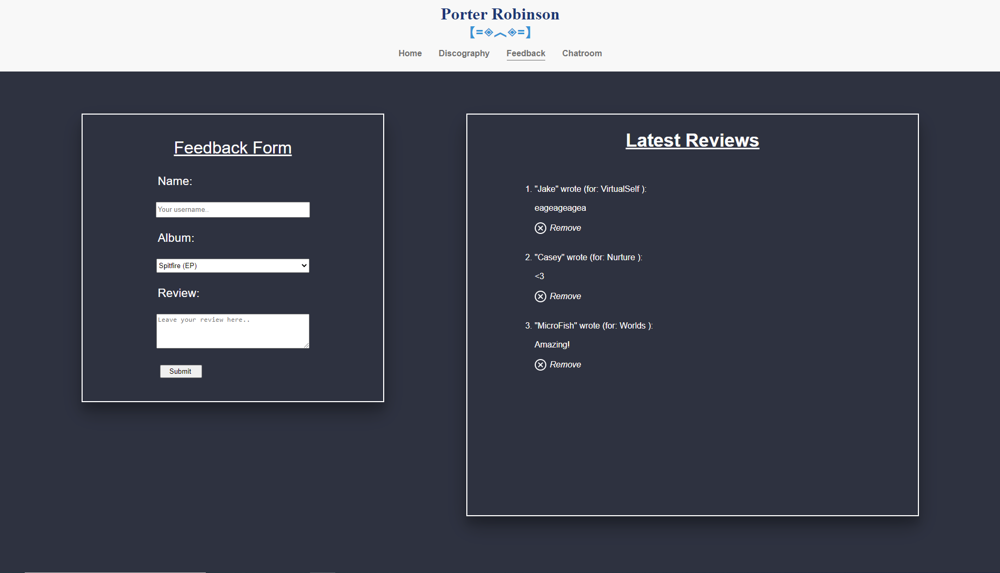
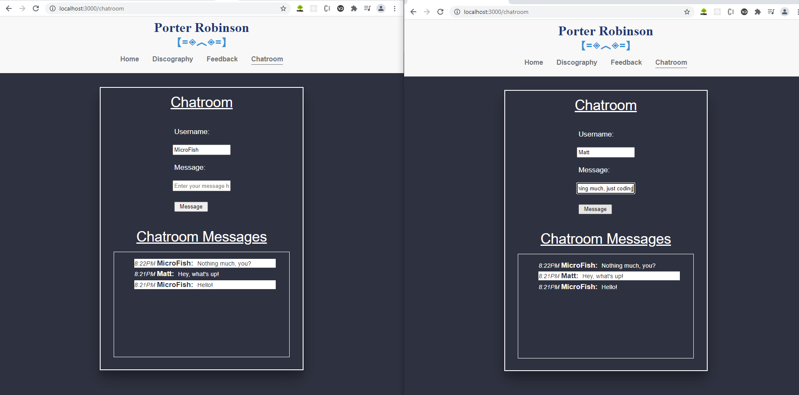

# PR Music Website
Put together a quick music website to demo. Showcases recent topics being explored such as setting up a back-end server with Node and Express (w/o database for now - reading/writing to and from local json file to simplify data storage). Focus of website is on EJS rendering with form data as well as an introduction to Socketio.  Five page types are showcased:  Home, Albums, Album, Feedback, and Chatroom (described below).

## How to Use
Feel free to clone down and boot from index

## Technologies Used
EJS, Express, Joi, Morgan, Node, Node FS Core, Socketio

## Page Breakdown

### 1. Home Page
Minimal landing page with navbar - nothing noteworthy to mention, just basic EJS rendering/CSS styling.

### 2. Albums Page
Reads through stored JSON and showcases all stored data. Gives option to click on an individual album for additional details.

### 3. Album Page
Filters out JSON data to portray the individual album listed.  Showcases additional details as well as a reviews section that pulls data from the reviews POSTed to our back-end route (stored in the feedback.json data file).  Also filters reviews that specifically pertain to the chosen album.

### 4. Feedback Page
Form to submit a review to an individual album.  Section to the right showcases some of the most recent updates.  Can hit the "remove" button to delete the data from our mock database.

### 5. Chatroom Page
Live chatroom to discuss music-related topics.  Example showcases two chatroom windows having a pleasant conversation.  Features use of socketio.

## Authors

Matthew Fisher
